# GreenLeaf Retail — Secure AWS Web Application Infrastructure

## Overview

This project demonstrates the design, deployment, security, testing, and recovery of a multi-tier web application environment in Amazon Web Services (AWS).

The project was completed as part of my **DevOps training with Emraay Solutions** and provided hands-on experience integrating AWS networking, security, compute, load balancing, Linux administration, MySQL, and application deployment.

The environment includes:

- IAM least-privilege access
- Custom VPC and CIDR design
- Public and private network segmentation
- Multi-Availability-Zone web tier
- Bastion-host administrative access
- NAT Gateway for private outbound internet access
- Nginx and PHP web servers
- Private MySQL database hosted on EC2
- Application Load Balancer
- Target Group health checks
- EC2 recovery using an Amazon Machine Image (AMI)
- Application-to-database communication over private networking
- Security Groups controlling communication between infrastructure tiers
- Failure testing and application troubleshooting

The final PHP Inventory Management System is accessed through an Application Load Balancer while its MySQL database remains isolated in a private subnet with no public IP address.

---

# Architecture

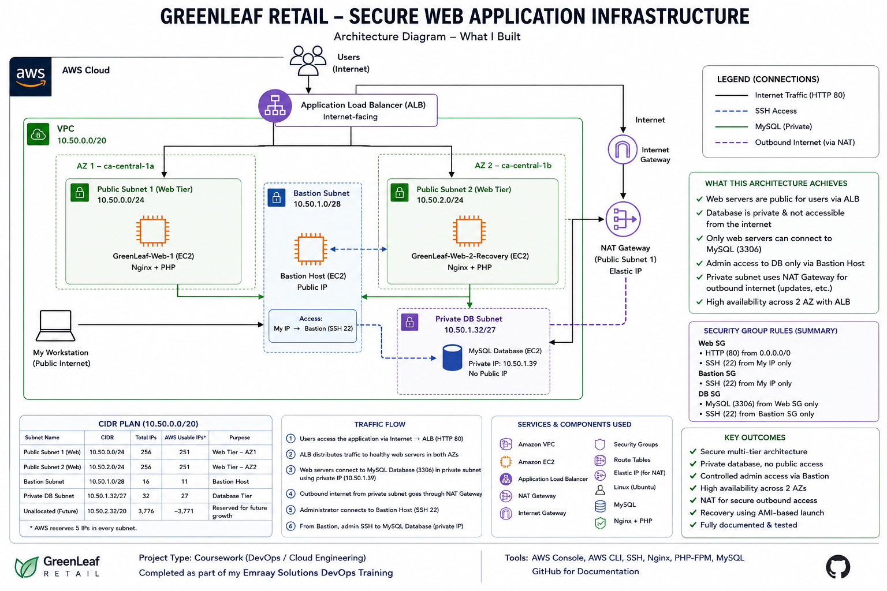

### Application Traffic

```text
Internet
   |
   v
Application Load Balancer
   |
   +--------------------+
   |                    |
   v                    v
GreenLeaf-Web-1    GreenLeaf-Web-2-Recovery
Nginx + PHP        Nginx + PHP
   |                    |
   +---------+----------+
             |
             | MySQL TCP 3306
             v
      GreenLeaf-Database
        10.50.1.39
        Private EC2
             |
             v
          MySQL
      shop_inventory
```

### Administrative Access

```text
Administrator Workstation
          |
          | SSH 22
          v
   GreenLeaf-Bastion
          |
          | SSH 22
          v
 GreenLeaf-Database
     Private IP
```

### Private Outbound Internet Access

```text
Private Database
       |
       v
Private Route Table
       |
       v
NAT Gateway
       |
       v
Internet Gateway
       |
       v
Internet
```

---

# AWS Services Used

| AWS Service | Purpose |
|---|---|
| IAM | Least-privilege deployment user and group |
| Amazon VPC | Custom isolated network environment |
| EC2 | Bastion, web servers, and MySQL database server |
| Security Groups | Control traffic between infrastructure tiers |
| Internet Gateway | Internet connectivity for public resources |
| NAT Gateway | Outbound internet access for the private database |
| Elastic IP | Public address used by the NAT Gateway |
| Route Tables | Public and private network routing |
| Application Load Balancer | Distributes application traffic across web servers |
| Target Groups | Health checks and backend web-server registration |
| Amazon Machine Image (AMI) | Web-server recovery |
| Amazon S3 | Permitted service for the deployment IAM user |

---

# 1. IAM Least-Privilege Access

A dedicated IAM deployment user was created:

`GreenLeaf-Deploy-User`

The user was added to:

`GreenLeaf-Deployment-Engineer`

The group was granted:

- Amazon EC2 access
- Amazon S3 access

IAM administrative permissions were deliberately excluded.

Permissions were assigned through the IAM group rather than directly to the user.

The deployment account was also configured as an AWS CLI profile:

```bash
greenleaf-deploy
```

To verify least-privilege access, an IAM operation was attempted:

```bash
aws iam list-users --profile greenleaf-deploy
```

The request returned:

```text
AccessDenied
```

This confirmed that the deployment engineer could perform the required deployment activities without being able to administer IAM.

### Evidence

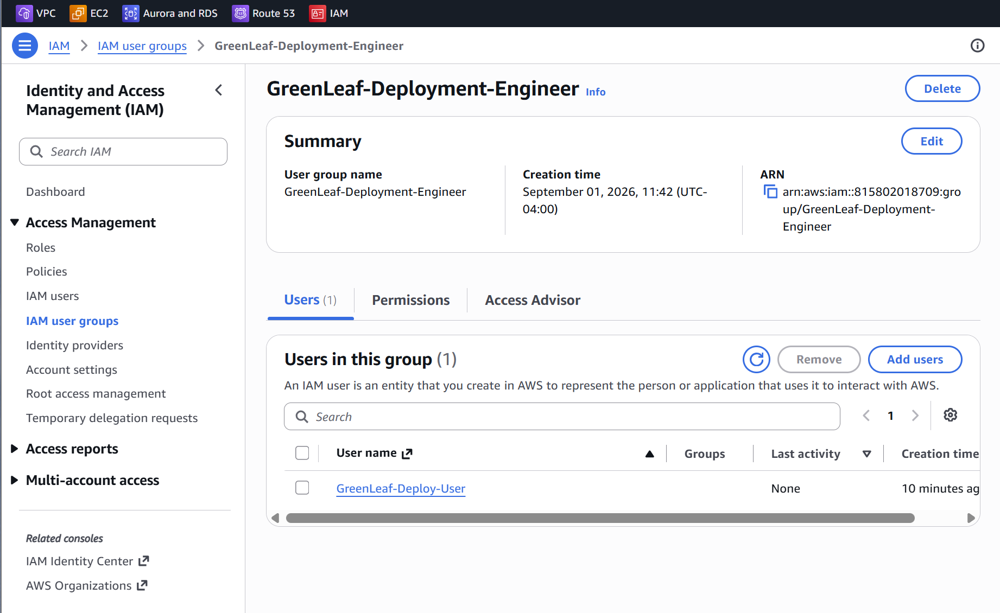

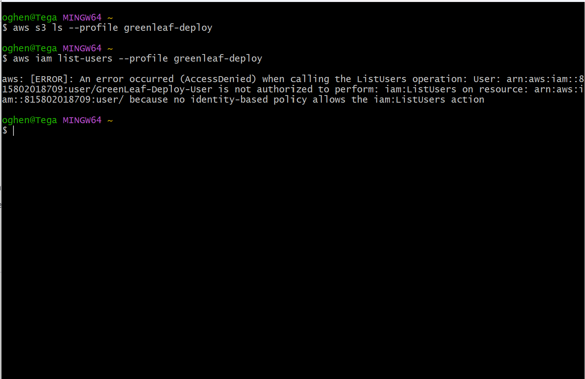

---

# 2. VPC and CIDR Design

The environment was deployed inside:

```text
GreenLeaf-VPC
10.50.0.0/20
```

A `/20` provides:

**4,096 total IPv4 addresses**

AWS reserves five IPv4 addresses in every subnet, so subnet capacity was calculated using:

```text
AWS usable addresses = Total subnet addresses - 5
```

The initial requirements were:

| Tier | Required Usable IPs | Selected CIDR | Total IPs | AWS Usable |
|---|---:|---:|---:|---:|
| Public Web | 200 | `/24` | 256 | 251 |
| Bastion | 10 | `/28` | 16 | 11 |
| Private Database | 25 | `/27` | 32 | 27 |

The final implemented subnets were:

| Subnet | CIDR | Purpose |
|---|---|---|
| GreenLeaf-Public-Web-Subnet | `10.50.0.0/24` | Web tier / ALB — AZ 1 |
| GreenLeaf-Public-Web-Subnet-2 | `10.50.2.0/24` | Web tier / ALB — AZ 2 |
| GreenLeaf-Bastion-Subnet | `10.50.1.0/28` | Bastion host |
| GreenLeaf-Private-DB-Subnet | `10.50.1.32/27` | Private MySQL database |

The second public `/24` subnet was added during implementation so the Application Load Balancer could operate across two Availability Zones.

Even after adding the second public subnet, more than 50% of the original `/20` address space remained available for future growth.

Detailed calculations are documented here:

[View CIDR Plan](docs/cidr-plan.md)

### Evidence

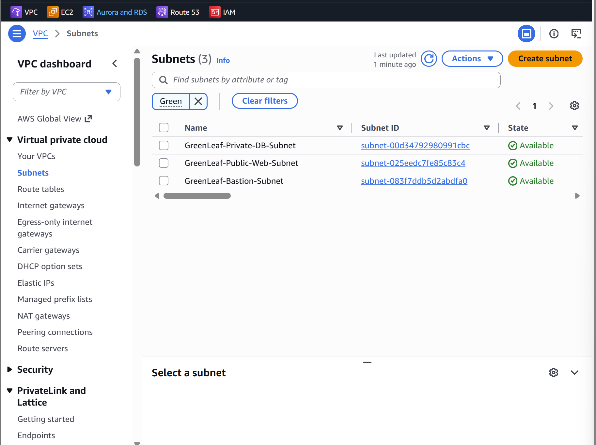

---

# 3. Public and Private Routing

An Internet Gateway was attached to `GreenLeaf-VPC`.

## Public Route Table

The public route table contained:

```text
10.50.0.0/20 → local
0.0.0.0/0    → Internet Gateway
```

It was associated with the public-facing subnets.

### Evidence

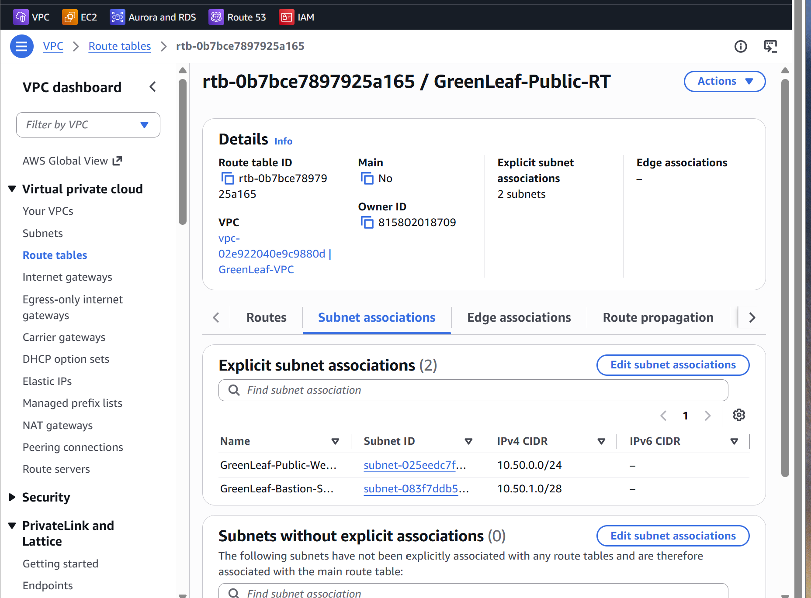

## Private Route Table

The database subnet initially had only:

```text
10.50.0.0/20 → local
```

There was no default internet route.

This was intentional so the behavior of a private subnet could be tested before NAT connectivity was introduced.

### Evidence

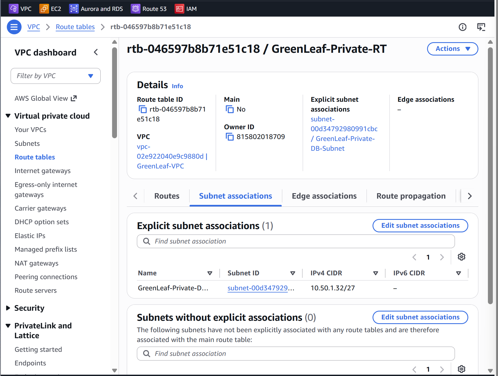

---

# 4. Security Group Design

Three primary Security Groups were created.

## GreenLeaf-Web-SG

Inbound:

```text
HTTP 80 ← 0.0.0.0/0
SSH 22  ← Administrator public IP only
```

## GreenLeaf-Bastion-SG

Inbound:

```text
SSH 22 ← Administrator public IP only
```

## GreenLeaf-Database-SG

Inbound:

```text
MySQL 3306 ← GreenLeaf-Web-SG only
SSH 22     ← GreenLeaf-Bastion-SG only
```

The database Security Group did not expose MySQL or SSH directly to the public internet.

Using Security Group references also meant database access was based on the role of the connecting AWS resource rather than broad public CIDR ranges.

---

# 5. Bastion Access to the Private Database

The MySQL database EC2 instance was launched with:

**No public IPv4 address**

It therefore could not be directly SSH'd into from the internet.

Administrative access followed:

```text
Local Workstation
       |
       | SSH
       v
GreenLeaf-Bastion
       |
       | SSH
       v
GreenLeaf-Database
```

The SSH private key remained on the administrator's workstation.

The key was loaded into `ssh-agent`:

```bash
eval "$(ssh-agent -s)"
ssh-add ~/.ssh/FirstKeyPair.pem
```

The private database was then reached through the bastion using ProxyJump:

```bash
ssh -J ubuntu@BASTION_PUBLIC_IP ubuntu@DATABASE_PRIVATE_IP
```

This allowed secure access to the private server without copying the private key onto the bastion host.

### Evidence

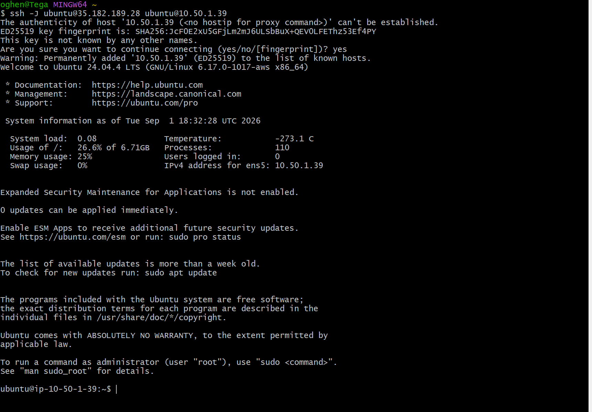

---

# 6. Private Subnet and NAT Gateway Testing

The private database initially had no route to the internet.

From the database server, the following command was tested:

```bash
sudo apt update
```

It failed because the private route table contained no internet route.

### Evidence — Before NAT

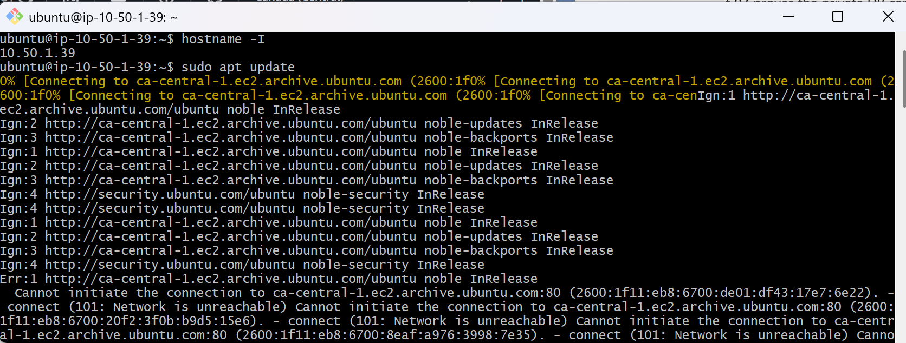

A NAT Gateway was then deployed in a public subnet.

The private route table was updated with:

```text
0.0.0.0/0 → GreenLeaf-NAT-Gateway
```

The same command was tested again:

```bash
sudo apt update
```

This time it succeeded.

### Evidence — After NAT

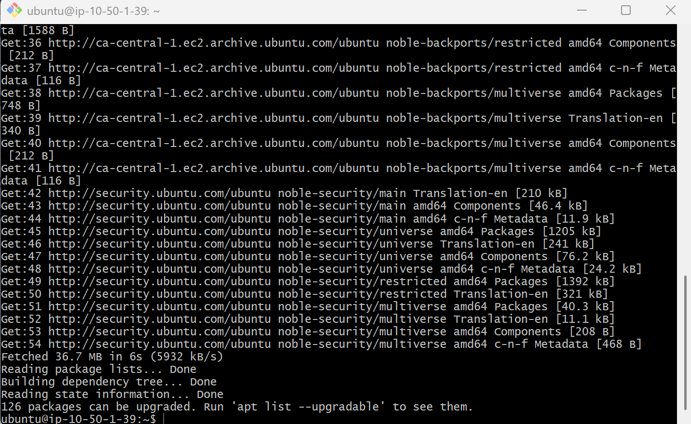

This demonstrated an important networking concept:

> A private EC2 instance can initiate outbound internet connections through a NAT Gateway without requiring a public IP address or accepting unsolicited inbound internet connections.

---

# 7. Multi-AZ Web Tier

Two web servers were deployed across separate Availability Zones:

```text
GreenLeaf-Web-1
ca-central-1a
```

and:

```text
GreenLeaf-Web-2
ca-central-1b
```

Nginx was installed on both servers.

A second public subnet was specifically created in another Availability Zone to support this architecture.

This provided the foundation for distributing application traffic across multiple instances instead of relying on a single web server.

---

# 8. Application Load Balancer

A Target Group was created:

```text
GreenLeaf-Web-TG
```

Both web servers were registered on HTTP port 80.

An internet-facing Application Load Balancer was then created:

```text
GreenLeaf-ALB
```

The ALB spanned the two public web subnets in separate Availability Zones.

The listener forwarded HTTP traffic to:

```text
GreenLeaf-Web-TG
```

Both EC2 targets were verified as:

```text
Healthy
```

### Evidence

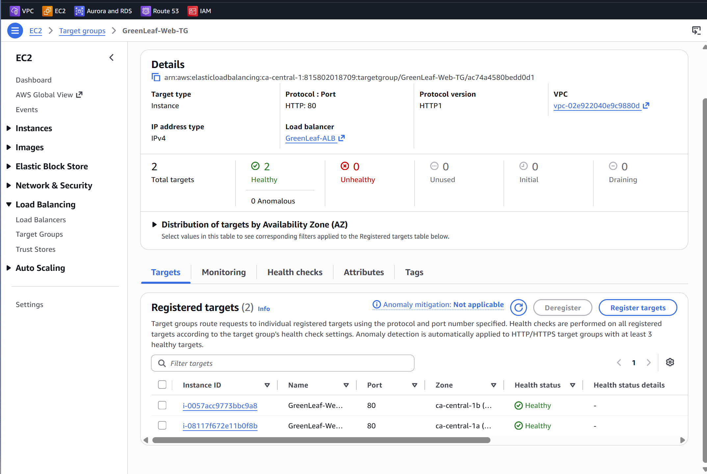

---

# 9. Load Balancing Verification

Before deploying the final PHP application, each Nginx server displayed a different server identifier.

Web-1 displayed:

```text
GreenLeaf Retail
Server: Web-1
```

Web-2 displayed:

```text
GreenLeaf Retail
Server: Web-2
```

The Application Load Balancer DNS endpoint was opened in a browser and refreshed multiple times.

Responses were received from both web servers, demonstrating that the ALB was distributing traffic across healthy targets.

### Evidence

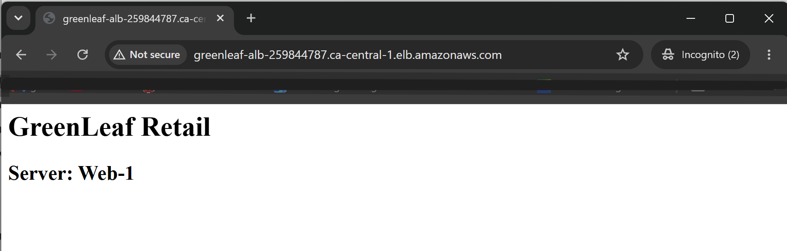

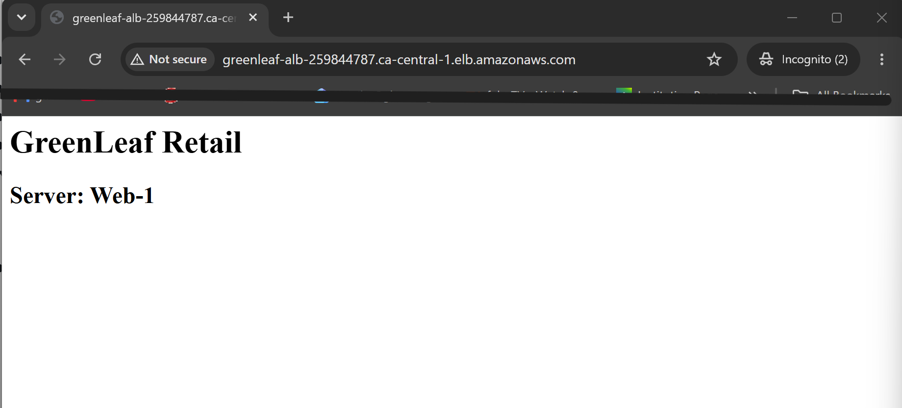

---

# 10. Failure and Recovery Test

The project also included a manual failure and recovery test.

An Amazon Machine Image was created from the configured web server:

```text
GreenLeaf-Web-Server-AMI
```

One of the web servers was deliberately terminated.

While that server was unavailable, the Application Load Balancer continued serving traffic through the remaining healthy target.

A replacement EC2 instance was then launched from the AMI:

```text
GreenLeaf-Web-2-Recovery
```

The recovered instance was placed in the second public subnet and registered with `GreenLeaf-Web-TG`.

After passing the ALB health check, the environment returned to:

```text
2 Healthy Targets
```

### Recovery Process

```text
Two Healthy Web Servers
          |
          v
Create Web Server AMI
          |
          v
Terminate Web-2
          |
          v
ALB continues using Web-1
          |
          v
Launch Web-2-Recovery from AMI
          |
          v
Register with Target Group
          |
          v
Two Healthy Targets Restored
```

### Evidence


> This project used manual AMI-based recovery. An Auto Scaling Group was not implemented.

---

# 11. Private MySQL Database

MySQL was installed directly on:

```text
GreenLeaf-Database
```

This was an EC2-hosted MySQL database, not Amazon RDS.

The server was located in:

```text
GreenLeaf-Private-DB-Subnet
```

with private IP:

```text
10.50.1.39
```

and no public IP.

MySQL was configured to listen for application connections:

```text
bind-address = 0.0.0.0
```

Network access was still restricted by `GreenLeaf-Database-SG`.

The application database was created:

```sql
CREATE DATABASE shop_inventory;
```

An application database user was configured:

```text
inventoryUser
```

The required SQL schema was then imported into `shop_inventory`.

---

# 12. PHP Inventory Management Application

A PHP Inventory Management System was deployed on the web tier.

The application stack included:

```text
Ubuntu Linux
Nginx
PHP-FPM
PHP MySQL extension
MySQL
Git
```

Required packages included:

```bash
sudo apt install nginx php-fpm php-mysql git -y
```

The application source code was deployed to both web servers.

Nginx was configured to process PHP using PHP-FPM:

```nginx
location ~ \.php$ {
    include snippets/fastcgi-php.conf;
    fastcgi_pass unix:/run/php/php8.3-fpm.sock;
}
```

The application was configured to connect to the database using the private address:

```text
DB Host: 10.50.1.39
Database: shop_inventory
User: inventoryUser
Port: 3306
```

No public database endpoint was required.

---

# 13. End-to-End Application Verification

The final application traffic path was:

```text
User
 |
 v
Application Load Balancer
 |
 v
Nginx / PHP Web Server
 |
 | Private MySQL TCP 3306
 v
GreenLeaf-Database
 |
 v
shop_inventory
```

The PHP Inventory Management System was successfully accessed through the Application Load Balancer.

Successful authentication and dashboard access demonstrated that:

1. The ALB could reach the web tier.
2. Nginx and PHP-FPM were functioning.
3. The PHP application could reach MySQL.
4. The database accepted traffic from the Web Security Group.
5. The application could query the private `shop_inventory` database.

### Evidence

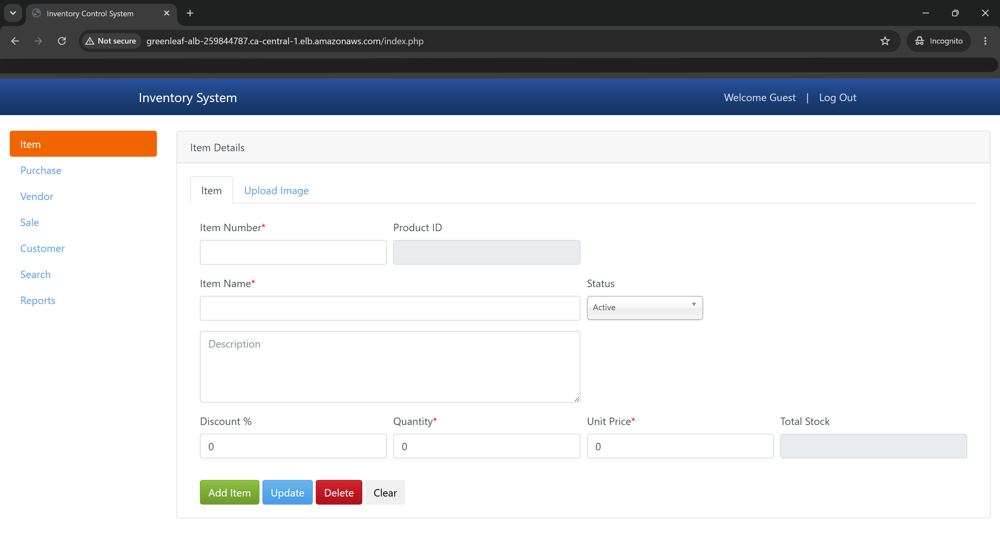

---

# 14. Redacted Database Configuration

The application configuration used the database's private VPC address.

Sensitive credentials were removed before documenting the configuration.

### Evidence

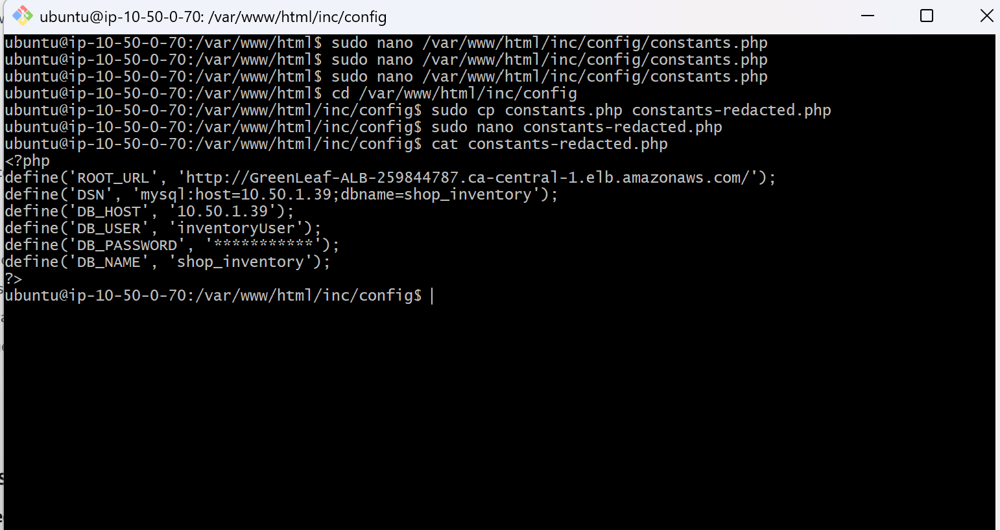

No database passwords, AWS access keys, private SSH keys, or other secrets are stored in this repository.

---

# Troubleshooting

Troubleshooting was an important part of the project rather than simply rebuilding resources whenever something failed.

## Private Database Could Not Access Package Repositories

### Symptom

```bash
sudo apt update
```

failed from the private database server.

### Cause

The database subnet intentionally had no default internet route.

### Resolution

A NAT Gateway was deployed in a public subnet and the private route table received:

```text
0.0.0.0/0 → NAT Gateway
```

The same `apt update` command then succeeded.

---

## Accessing the Private Database

### Challenge

The database had no public IP address.

### Solution

The Bastion Host was used as an SSH jump host:

```bash
ssh -J ubuntu@BASTION_PUBLIC_IP ubuntu@DATABASE_PRIVATE_IP
```

This maintained the private-only design of the database tier.

---

## Application Dashboard Failed After Login

### Symptom

The application login page loaded and authentication worked, but the dashboard did not render correctly.

### Investigation

The Nginx error log was inspected:

```bash
sudo tail -n 30 /var/log/nginx/error.log
```

The log reported:

```text
Undefined constant "ROOT_URL"
```

### Resolution

The PHP application configuration was corrected and `ROOT_URL` was configured to use the Application Load Balancer endpoint.

The required services were restarted and the application dashboard loaded successfully.

This reinforced the importance of identifying the failing layer and checking application/server logs before making infrastructure changes.

---

# Security Decisions

Several security principles were applied throughout the project:

- The database EC2 instance has no public IP.
- MySQL port 3306 is not exposed directly to the internet.
- MySQL access is permitted from the Web Security Group only.
- Database SSH access is permitted from the Bastion Security Group only.
- Bastion SSH access is restricted to the administrator's public IP.
- IAM permissions are inherited through a group.
- IAM administrative access was deliberately excluded from the deployment engineer.
- The IAM restriction was tested through AWS CLI.
- Private resources use NAT for controlled outbound internet connectivity.
- The SSH private key remains on the administrator's workstation.
- Sensitive credentials are excluded from GitHub documentation.

---

# Key Lessons Learned

This project helped connect individual AWS services into a complete working architecture.

### 1. Design the Network Before Deploying

Calculating CIDR requirements before creating subnets helped avoid overlapping networks and ensured that each tier had enough usable addresses while preserving space for future growth.

### 2. Private Does Not Mean No Internet Access

A private EC2 instance can use a NAT Gateway for outbound internet connectivity while remaining inaccessible directly from the public internet.

### 3. Test Security Controls

Creating an IAM policy or Security Group rule is not enough.

The IAM restriction was deliberately tested through AWS CLI to verify that unauthorized operations were actually denied.

### 4. Security Groups Can Define Trust Between Tiers

Instead of exposing MySQL to a broad CIDR range, the database accepted port 3306 from the Web Security Group.

This created a clearer trust relationship between the application and database tiers.

### 5. High Availability Should Be Tested

Running two servers does not automatically prove resilience.

Terminating one web server demonstrated how the ALB reacted to a failed target and continued sending traffic to the healthy server.

### 6. AMIs Provide a Practical Recovery Mechanism

Creating an AMI from a working server allowed a replacement EC2 instance to be launched without rebuilding the server manually from the beginning.

### 7. Follow the Traffic Path When Troubleshooting

The project reinforced the importance of understanding:

```text
User → ALB → Web Server → Application → Private Database
```

When something fails, identifying which layer is responsible is more effective than randomly changing infrastructure settings.

### 8. Logs Are an Important Troubleshooting Tool

The `ROOT_URL` problem was identified from the Nginx error log.

The issue was application configuration, not AWS networking.

### 9. Architecture Is About Controlled Communication

One of the biggest lessons from the project was understanding not only which AWS resources were required, but:

- Why each resource exists
- Which systems should communicate
- Which ports should be allowed
- Which resources should remain private
- How administrators should access private systems
- What should happen when infrastructure fails

---

# Project Outcomes

The completed environment demonstrated:

- Least-privilege IAM access
- CIDR planning and subnet sizing
- Public/private AWS network segmentation
- Multi-AZ web architecture
- Bastion-host access
- Security Group referencing
- Private EC2 outbound connectivity through NAT
- Application Load Balancing
- Target Group health checks
- Manual failure testing
- AMI-based EC2 recovery
- Nginx and PHP-FPM deployment
- Private MySQL connectivity
- End-to-end PHP application deployment
- Linux troubleshooting using server logs
- Technical documentation with implementation evidence

---

# Project Evidence

| Screenshot | Evidence |
|---|---|
| 01 | IAM group membership |
| 02 | IAM CLI AccessDenied |
| 03 | VPC and subnet architecture |
| 04 | Public route table |
| 05 | Private route table before NAT |
| 06 | Bastion jump-host connection to private DB |
| 07 | Private DB `apt update` failure before NAT |
| 08 | Successful connectivity after NAT |
| 09 | Two healthy ALB target instances |
| 10 | ALB serving Web-1 |
| 11 | ALB serving Web-2 |
| 12 | AMI-based EC2 recovery |
| 13 | Inventory application through ALB |
| 14 | Redacted private database configuration |

---

# Repository Structure

```text
greenleaf-secure-aws-infrastructure/
│
├── README.md
│
├── docs/
│   ├── cidr-plan.md
│   └── GreenLeaf_Retail_Final_AWS_Architecture.png
│
└── screenshots/
    ├── 01-iam-group-membership.png
    ├── 02-iam-cli-access-denied.png
    ├── 03-vpc-subnets.png
    ├── 04-public-route-table.png
    ├── 05-private-route-table-before-nat.png
    ├── 06-bastion-jump-to-private-db.png
    ├── 07-db-no-nat-failed.png
    ├── 08-db-nat-success.png
    ├── 09-target-group-both-healthy.png
    ├── 10-alb-web1.png
    ├── 11-alb-web2.png
    ├── 12-instance-recovery.png
    ├── 13-inventory-dashboard-via-alb.png
    └── 14-database-config-redacted.png
```

---

# Tools and Technologies

### AWS

`IAM` `VPC` `EC2` `ALB` `Target Groups` `NAT Gateway` `Internet Gateway` `Route Tables` `Security Groups` `AMI` `S3`

### Application / Systems

`Ubuntu Linux` `Nginx` `PHP` `PHP-FPM` `MySQL` `SSH`

### Development / Administration

`AWS Console` `AWS CLI` `Git` `GitHub`

---

# Project Context

This project was completed as part of my **DevOps training with Emraay Solutions**.

The purpose of the capstone was to apply cloud infrastructure concepts in a practical environment by designing, deploying, securing, testing, troubleshooting, recovering, and documenting a working AWS application architecture.

---

# Conclusion

The GreenLeaf Retail capstone brought together networking, security, compute, load balancing, Linux administration, database management, application deployment, and troubleshooting in one project.

The final architecture provides a public application tier behind an Application Load Balancer while keeping the MySQL database isolated in a private subnet.

More importantly, the project went beyond simply deploying resources.

Security restrictions were tested, private connectivity was validated before and after NAT, load balancing was demonstrated, a web server was deliberately terminated, recovery was performed using an AMI, and an application-level problem was diagnosed using server logs.

The biggest takeaway was that cloud engineering is not simply about knowing individual AWS services.

It is about understanding **why each component exists, how resources communicate securely, how traffic moves through the architecture, and what happens when something fails.**